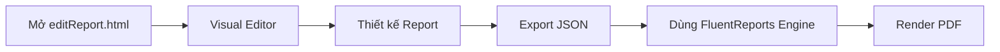

# FluentReports Editor — Kiến Trúc, API & Tài Liệu Tham Chiếu

## 1. Tổng Quan

**FluentReports** là một Data Driven PDF Reporting Engine cho **Node.js** và **Browsers**, được phát triển bởi Nathanael Anderson.

- **GitHub**: [NathanaelA/fluentreports](https://github.com/nathanaela/fluentReports)
- **Website/Demo**: [fluentreports.com](https://www.fluentreports.com)
- **npm**: `npm install fluentreports`

Dự án của bạn sử dụng **FluentReports Editor** (browser-based visual report designer) để thiết kế và chỉnh sửa report, xuất ra file JSON mô tả report, sau đó dùng FluentReports Engine để render thành PDF.

---

## 2. Cấu Trúc Dự Án

```
d:\Source\ReportFluent\
├── editReport.html          # Entry point - HTML chứa editor
├── combined.js              # Bundle JS (~3.4MB) chứa toàn bộ engine + editor
├── fluentReports.css        # CSS cho visual editor
├── Backup/                  # Thư mục backup
├── report.json              # Report template chính
├── report (1).json          # Report template (bản sao/version)
├── MauLamSang.json          # Mẫu lâm sàng (lớn nhất ~375KB)
├── MauLamSang11-12.json     # Mẫu lâm sàng phiên bản 11-12
├── MauLamSangXuongHang.json # Mẫu lâm sàng xuống hàng
├── Mau1.json                # Mẫu report 1
├── Mau11-12.json            # Mẫu report 11-12
├── Mau-PK-Gian-Hoang.json   # Mẫu PK Gian Hoang
├── ChiDinhLamSang1812.json  # Chỉ định lâm sàng
├── Font15PKXuongHang.json   # Mẫu font 15 PK xuống hàng
├── MauTenPkXuongHang19-12.json
├── ThemPhanCachTableThuoc.json
├── report-*.json            # Các phiên bản report theo ngày
├── test.json
├── pdfGenerator.js          # [NEW] Utility render PDF không phụ thuộc DOM canvas
└── KI.md                    # Tài liệu ghi chú kiến thức, kinh nghiệm phát triển
```

### 2.1 Kiến Trúc 3 File Chính

| File | Kích thước | Vai trò |
|------|-----------|---------|
| [editReport.html](file:///d:/Source/ReportFluent/editReport.html) | 793B | Entry point HTML. Mount editor vào `#fluentReportsEditor` div |
| [combined.js](file:///d:/Source/ReportFluent/combined.js) | 3.4MB (40,830 dòng) | Bundle chứa toàn bộ library + editor |
| [fluentReports.css](file:///d:/Source/ReportFluent/fluentReports.css) | 9.6KB (449 dòng) | CSS layout cho visual editor |

---

## 3. editReport.html — Entry Point

```html
<head>
    <meta charset="utf-8">
    <title>Design Report</title>
    <link rel="stylesheet" href="./fluentReports.css">
    <script>demo_screen=2;</script>  <!-- Biến điều khiển demo mode -->
    <script src="./combined.js"></script>
    <style>
        #fluentReportsEditor {
            border: solid black 1px;
            height: 95vh;
        }
    </style>
</head>
<body>
    <div id="fluentReportsEditor"></div>
</body>
```

> [!NOTE]
> `demo_screen=2` là biến global cho biết chế độ demo. Editor tự động mount vào div `#fluentReportsEditor`.

---

## 4. combined.js — Bundle Analysis

File **combined.js** (~3.4MB, 40,830 dòng) là một bundle chứa nhiều thư viện:

### 4.1 Thư Viện Bundled

| Thư viện | Dòng bắt đầu | Vai trò |
|----------|-------------|---------|
| **PlainDraggable** v2.5.12 | Line 1 | Drag & drop cho các element trong editor |
| **Base64/Buffer polyfills** | Line ~1980+ | Polyfill cho browser (byteLength, toByteArray, etc.) |
| **PDFKit** (embedded) | Trong bundle | Engine tạo PDF (node + browser) |
| **FluentReports Engine** | Trong bundle | Report rendering engine |
| **FluentReports Editor** | Trong bundle | Visual report designer |
| **Font data** (base64) | Cuối file (~Line 40700+) | Fonts Times Bold, Times Italic, Times New Roman embedded |

### 4.2 Demo Report Data (cuối file)

Cuối file combined.js chứa demo report data dạng JSON object với:
- `type: "report"`, `version: 2`
- Các `variable` tham chiếu dữ liệu: `bs_ten`, `kb_ghi_chu1`, `kb_sdt_nguoi_giam_ho`, `kb_nguoi_giam_ho`
- `print` settings: `absoluteX`, `absoluteY`, `font`, `fontSize`
- `fixedHeight: true`, `height: 418`
- Fonts array với embedded base64 font data

---

## 5. fluentReports.css — Editor UI Layout

### 5.1 CSS Grid Layout

Editor sử dụng **CSS Grid** với layout 2 cột:

```css
.fluentReports {
    display: grid;
    grid-template-columns: 200px 1fr;       /* Sidebar 200px | Main area */
    grid-template-rows: 50px calc(100% - 51px); /* Toolbar 50px | Content */
    font-family: "HelveticaNeue", Helvetica, Arial, sans-serif;
    font-size: 12px;
}
```

### 5.2 Layout Areas

| CSS Class | Grid Position | Vai trò |
|-----------|-------------|---------|
| `.frToolBar` | col 1-3, row 1 | Toolbar trên cùng (bg: #336699) |
| `.frPropScroller` | col 1, row 2 | Sidebar Properties panel (bg: #336699) |
| `.frReport` | col 2, row 2 | Main report canvas (bg: #a9a9a9) |

### 5.3 Các Class CSS Quan Trọng

| Class | Vai trò |
|-------|---------|
| `.frBand` | Band/dải trong report (bg: #b9b9b9) |
| `.frLabel`, `.frField`, `.frTitledElement` | Các element trong report (border: transparent 3px) |
| `.frSelected` | Element được chọn (border: #30c7ff solid 3px) |
| `.frDialog` | Dialog popup |
| `.frIconClickable` | Icon có thể click (cursor: pointer) |
| `.frPropInput` | Input trong properties panel |
| `.frPropSelect` | Select trong properties panel |
| `.frPropButton` | Button trong properties panel |
| `.frTitleDiv` | Title div (gradient: white → grey) |
| `.frError` | Error display (bg: red, color: white) |
| `.frHidden` | Ẩn element |
| `.frIcon` | Custom icon font "fr" |
| `.frSectionEditor*` | Section editor UI (tree view, drag/drop) |

### 5.4 Section Editor CSS

Editor có Section Editor với tree view:
- `.frSectionEditorTreeView` — Tree view container (200×200px)
- `.frSectionEditorDetailsView` — Details panel (200×200px)
- `.frSectionEditorSelectedTree` — Node được chọn (bg: #B7B6B6)
- `.frSectionEditorValidDropLocation` — Drop zone hợp lệ (border: green)
- `.frSectionEditorInValidDropLocation` — Drop zone không hợp lệ (border: red)
- `.frSectionEditorGhostElement` — Ghost element khi drag (opacity: 0.5)

---

## 6. Report JSON Format

### 6.1 Cấu Trúc Cơ Bản

```json
{
  "type": "report",
  "dataUUID": 10004,
  "version": 2,
  "fontSize": 13,
  "autoPrint": false,
  "name": "buffer",
  "paperSize": "letter",
  "paperOrientation": "portrait",
  "margins": {
    "left": 20,
    "top": 15,
    "right": 15,
    "bottom": 15
  },
  "fonts": [...],
  "header": {...},
  "detail": {...},
  "footer": {...},
  "data": []
}
```

### 6.2 Paper Sizes

| Giá trị | Kích thước |
|---------|-----------|
| `letter` | 612×792 pt (8.5×11 in) |
| `legal` | 612×1008 pt |
| `A4` | 595×842 pt |
| `A0`-`A10`, `B0`-`B10`, `C0`-`C10` | ISO sizes |
| `Executive`, `Folio`, `Tabloid` | Khác |

### 6.3 Fonts Section

Fonts được embed trực tiếp dưới dạng **base64 encoded** font data:

```json
{
  "fonts": [
    {
      "name": "Times Bold",
      "data": "AAEAAAARAQAABAAQTFRTSKnc..." 
    },
    {
      "name": "Times Italic",
      "data": "AAEAAAAQAQAABAAETFRT..."
    },
    {
      "name": "Times New Roman",
      "data": "AAEAAAASAQAABAAg..."
    }
  ]
}
```

> [!IMPORTANT]
> Font data rất lớn (vài trăm KB mỗi font). Đây là lý do các file report JSON có dung lượng lớn (15-375KB).

### 6.4 Report Sections (Header/Detail/Footer)

Mỗi section chứa array các **elements**:

#### Print Element
```json
{
  "type": "print",
  "settings": {
    "absoluteX": 0,
    "absoluteY": 287,
    "font": "Times Italic",
    "fontSize": 10
  },
  "variable": "kb_ghi_chu1"
}
```

#### Band Element
```json
{
  "type": "band",
  "fields": [
    {
      "text": "STT",
      "width": 30,
      "align": 2
    },
    {
      "variable": "bs_ten",
      "width": {
        "type": "function",
        "name": "Function",
        "function": "return 200;",
        "async": false
      },
      "align": 2
    }
  ]
}
```

### 6.5 Element Types

| Type | Mô tả |
|------|--------|
| `print` | In text/variable tại vị trí tuyệt đối |
| `band` | Dải ngang chứa nhiều field |
| `newLine` | Xuống dòng |
| `image` | Hình ảnh |
| `shape` | Hình vẽ (rectangle, line, etc.) |

### 6.6 Settings Properties

| Property | Mô tả | Ví dụ |
|----------|--------|-------|
| `absoluteX` | Vị trí X tuyệt đối (pt) | `0` |
| `absoluteY` | Vị trí Y tuyệt đối (pt) | `287` |
| `font` | Tên font | `"Times Italic"` |
| `fontSize` | Cỡ chữ | `10` |
| `align` | Canh lề (0=left, 1=center, 2=right) | `2` |
| `fixedHeight` | Chiều cao cố định | `true` |
| `height` | Chiều cao section (pt) | `418` |

### 6.7 Width Function

Width có thể là số hoặc function:
```json
{
  "width": {
    "type": "function",
    "name": "Function",
    "function": "return 200;",
    "async": false
  }
}
```

---

## 7. FluentReports API (commands.md)

### 7.1 Tạo Report

```javascript
const Report = require('fluentReports').Report;
// ESM: import { Report } from 'fluentReports/lib/esm/fluentReports.mjs';

var rpt = new Report("MyCoolReport.pdf", {
  autoPrint: true,
  paper: "letter",        // letter, legal, A4, etc.
  landscape: false,
  font: "Helvetica",      // Default font
  fontSize: 12,
  margins: { left: 72, top: 72, bottom: 72, right: 72 },
  negativeParentheses: false
});
```

### 7.2 API Methods Chính

| Method | Mô tả |
|--------|--------|
| `.data(Data)` | **BẮT BUỘC** - Set data (array, object, query function) |
| `.keys(keys)` | Set key(s) cho sub-report data queries |
| `.detail(output)` | Định nghĩa cách in mỗi record |
| `.titleHeader(output, opts)` | Header chỉ trang đầu |
| `.header(output, opts)` | Header mọi trang |
| `.footer(output, opts)` | Footer mọi trang |
| `.summaryFooter(output, opts)` | Footer cuối report |
| `.addReport(report, opts)` | Thêm sub-report |
| `.userData(data)` | Set user data tùy chỉnh |
| `.totalFormatter(fn)` | Hàm format tổng |
| `.recordCount(callback)` | Callback khi biết số record |
| `.info(info)` | Set PDF metadata |
| `.render(callback)` | Render report thành PDF |

### 7.3 Detail Output Formats

```javascript
// Array format: [[key, width, alignment], ...]
rpt.detail([["name", 120], ["address", 200], ["state", 20]]);

// Template string format
rpt.detail("{{name}} lives in the state of {{state}}");

// Function format (async)
rpt.detail(function(report, data, state, done) {
  report.print(data.name);
  report.newLine();
  done();
});
```

### 7.4 Constants

```javascript
Report.show.once          // Header/footer chỉ 1 lần
Report.show.newPageOnly   // Mỗi trang mới (nếu đang active)
Report.show.always        // Luôn luôn

Report.alignment.LEFT
Report.alignment.CENTER
Report.alignment.RIGHT

Report.renderType.file
Report.renderType.pipe
Report.renderType.buffer
```

### 7.5 Report Hierarchy

```
Primary Report Object
  └── ReportSection
        └── ReportDataSet
              └── ReportGroup  ← (Đây là object trả về từ new Report())
```

---

## 8. Các Report JSON Mẫu (Dự Án Y Tế)

### 8.1 Biến (Variables) Thường Dùng

Từ phân tích các file JSON, các biến liên quan đến hệ thống y tế:

| Variable | Mô tả |
|----------|--------|
| `bs_ten` | Tên bác sĩ |
| `kb_ghi_chu1` | Ghi chú khám bệnh |
| `kb_sdt_nguoi_giam_ho` | SĐT người giám hộ |
| `kb_nguoi_giam_ho` | Tên người giám hộ |

### 8.2 Fonts Đã Embed

| Font Name | Sử dụng |
|-----------|---------|
| `Times Bold` | Tiêu đề, heading |
| `Times Italic` | Ghi chú, chú thích |
| `Times New Roman` | Nội dung chính |

---

## 9. Cách Sử Dụng Editor

### 9.1 Mở Editor
1. Mở file `editReport.html` trong browser
2. Editor sẽ tự mount vào div `#fluentReportsEditor`
3. Giao diện gồm: Toolbar (trên) + Properties Panel (trái) + Canvas (phải)

### 9.2 Workflow



### 9.3 Import/Export
- Editor cho phép **import** file JSON report
- Editor cho phép **export** report design thành JSON
- JSON file chứa toàn bộ layout + fonts embedded

---

## 10. Lưu Ý Quan Trọng

> [!WARNING]
> - **combined.js** là file bundle minified, KHÔNG nên sửa trực tiếp
> - Font data embedded làm file JSON rất lớn
> - `demo_screen=2` trong HTML là biến điều khiển — thay đổi giá trị sẽ ảnh hưởng editor behavior

> [!TIP]
> - Khi cần thay đổi font, sửa trong JSON (section `fonts`)
> - Khi cần thay đổi layout, sửa `absoluteX`, `absoluteY` trong settings
> - Dùng `fixedHeight: true` + `height` để cố định chiều cao section
> - `align: 0` = left, `align: 1` = center, `align: 2` = right

---

## 11. Nhật Ký Cải Tiến & Kinh Nghiệm Phát Triển (Bản cập nhật Mới)

Dưới đây là tổng hợp các cải tiến quan trọng về tính năng, trải nghiệm UI/UX và logic lõi được thực hiện trong phiên bản Editor nâng cấp:

### 11.1 Trải Nghiệm UI/UX & Thiết Kế Thẩm Mỹ
- **Thanh cuộn (Scrollbar) Hiện Đại**: Tối ưu hóa toàn bộ các thanh cuộn dọc/ngang của Editor sử dụng màu sắc đồng bộ với theme tối Catppuccin Mocha.
- **Căn Lề Properties Sidebar**: Khắc phục lỗi lệch cột khi căn chỉnh lề (left/center/right) của các thuộc tính dạng Checkbox, mang lại trải nghiệm click thẳng hàng, trực quan.
- **Hiện Đại Hóa Toolbar & Icon**: Loại bỏ hoàn toàn các emoji và ký tự Unicode thô lỗi thời trên thanh công cụ và bảng danh sách. Thay thế bằng các **SVG Icons** thiết kế phẳng, sắc nét và hỗ trợ chế độ tối/sáng.
- **Tính Năng Chọn Số Góc Đa Giác (Polygon Sides)**: Thêm trường cấu hình "Số góc" cho loại hình học là đa giác. Trình soạn thảo tự động sinh tọa độ các đỉnh tương đối ứng với đa giác đều (3 cho tam giác, 5 cho ngũ giác, 6 cho lục giác...). Khi co giãn kích thước rộng/cao (W/H), tọa độ các đỉnh sẽ tự động tỉ lệ để đảm bảo đa giác đều vừa khít kích thước mới.
- **Tự động trừ lề khi đặt chiều rộng dạng phần trăm (Width 100%)**: Đối với các phần tử có chiều rộng khai báo dạng phần trăm (ví dụ: `100%`), Canvas sẽ tự động tính toán và hiển thị đúng chiều rộng vùng in (chiều rộng giấy trừ đi lề trái và lề phải) thay vì tràn ra toàn khổ giấy. Điều này đảm bảo giao diện thiết kế hiển thị chuẩn xác, khớp hoàn toàn với PDF xuất ra.

### 11.2 Panel & Phân Cấp Phần Tử (Drag-and-Drop)
- **Hệ Thống Quan Hệ Cha - Con (Parent-Child Bindings)**: 
  - Khi kéo và thả bất kỳ phần tử nào vào bên trong một **Panel**, trình soạn thảo sẽ tự động gán `parentId` của phần tử đó trỏ về ID của Panel chứa nó.
  - Trong bảng quản lý danh sách phần tử (Elements Outline), các phần tử con được nhóm thụt lề dưới Panel cha của chúng.
- **Tự Động Mở Rộng Trang & Phân Trang Trực Quan (Multi-page Canvas)**:
  - Khắc phục giới hạn kéo thả phần tử ở trang 1. Canvas tự động tính toán tổng số trang (`totalPages`) dựa vào vị trí phần tử và ngắt trang (`pagebreak`) để kéo giãn chiều cao nền giấy.
  - Vẽ đường phân trang đứt nét kèm nhãn màu sắc nổi bật ("Trang 2", "Trang 3"...) giúp định vị chính xác vị trí ngắt trang thực tế khi xuất PDF.
  - Margin Guides (đường viền lề) được hiển thị lặp lại chính xác ở mọi trang để căn chỉnh chính xác.
- **Hút Khung Căn Lề (Margin Snapping)**: Hỗ trợ tự động hút (snap) khi kéo phần tử về sát lề trái, lề phải của tài liệu hoặc lề trên, lề dưới của từng trang. Canvas vẽ đường gióng phụ đứt nét màu đỏ trùng với lề trang khi hút, hỗ trợ căn chỉnh chuẩn xác theo thiết kế vùng in.
- **Hút Kề Nhau (Adjacent Snapping)**: Khắc phục giới hạn chỉ hút khi các cạnh trùng nhau. Hệ thống nay hỗ trợ hút dính mép ngoài khi hai phần tử chạm cạnh kề nhau (mép phải phần tử này chạm mép trái phần tử kia, hoặc mép dưới chạm mép trên), giúp việc sắp xếp các phần tử nối tiếp nhau hoặc xếp chồng lên nhau trở nên cực kỳ dễ dàng và khít sát.
- **Fix Lỗi Click Chọn Panel**: Sửa lỗi Panel bị mất sự kiện tương tác và không thể click hiển thị Properties sau khi di chuyển trên Canvas (do phần tử con bên trong đè z-index ngăn cản mouse click). Xử lý bằng cách phân phối lại sự kiện click qua layer bao phủ hoặc tính toán vị trí nhấn chuột.
- **Đồng Bộ Thứ Tự Outline List ("Trên đè dưới")**: Thứ tự các phần tử trong Elements Outline được sắp xếp ngược lại và nhóm hợp lý (Panels render trước ở dưới cùng, các element văn bản/hình vẽ nằm trên đè lên) để khớp hoàn hảo với thứ tự hiển thị z-index trên Canvas.

### 11.3 Tích Hợp Hệ Thống JSON Inspector Trực Tiếp
- Thêm nút **Xem JSON** trên Toolbar, mở ra một modal cửa sổ hiển thị trực tiếp cấu trúc thiết kế JSON hiện tại.
- Cho phép người dùng chỉnh sửa trực tiếp dữ liệu JSON tại modal này và bấm **"Cập Nhật Canvas"** để load lại tức thì thay vì phải export/import thủ công qua file.

### 11.4 Giải Pháp Xuất PDF Không Phụ Thuộc DOM Canvas (Dành Cho Vue)
- **Module độc lập [pdfGenerator.js](file:///d:/Source/ReportFluent/pdfGenerator.js)**: Được tách hoàn toàn khỏi các lệnh DOM (`querySelector`, `offsetHeight`), cho phép sinh tài liệu trực tiếp từ Node.js hoặc các framework SPA (Vue 2, Vue 3, React).
- **Bản đóng gói sẵn không phụ thuộc [pdfGenerator.bundle.js](file:///d:/Source/ReportFluent/pdfGenerator.bundle.js)**: Nén và tích hợp sẵn toàn bộ thư viện `pdfmake` (v0.2.10) và bộ font `vfs_fonts` (Roboto) cùng với logic xử lý layout PDF vào một file duy nhất. Giúp dự án Vue có thể gọi xuất PDF trực tiếp mà không cần chạy `npm install pdfmake` hay tải qua mạng (phù hợp với môi trường offline/intranet).
- **Hàm Ước Lượng Chiều Cao Tĩnh (`getElementHeight`)**: Đảm bảo phân trang (pagebreak) chính xác ngay cả khi chạy ngầm trên máy chủ hoặc ứng dụng web nhờ cơ chế nội suy kích thước tĩnh từ font size, số dòng bảng biểu và các chỉ số hình học.
- **Tương Thích Đầy Đủ**: Hỗ trợ xuất SVG xoay góc, định dạng cột linh hoạt, các bảng dữ liệu động lồng biến số (`fieldMappings`, `dataVar`) và hình ảnh mã hóa base64.

### 11.5 Bản Dịch Tiếng Anh & Tối Ưu Hóa Giao Diện Properties (Bản cập nhật mới nhất)
- **Bản dịch Tiếng Anh Toàn Diện (Full English Localization)**:
  - Việt hóa/Anh hóa toàn bộ nhãn giao diện, nút bấm, tiêu đề, các hộp thoại cảnh báo/nhập liệu trong biên tập viên ([editor-pdfmake.html](file:///d:/Source/ReportFluent/editor-pdfmake.html) và [editor-pdfmake.js](file:///d:/Source/ReportFluent/editor-pdfmake.js)).
  - Chuyển đổi toàn bộ tên các biến giả lập mặc định sang Tiếng Anh (ví dụ: `pk_ten` -> `clinic_name`, `bn_ten` -> `patient_name`, `toa_thuoc` -> `medications`).
  - Cập nhật nhãn lớp phần tử ẩn `.hidden-preview` trong CSS từ `"Ẩn"` thành `"Hidden"`.
  - Việt hóa/Anh hóa mẫu đơn thuốc chạy thử ([demo-pdfmake.html](file:///d:/Source/ReportFluent/demo-pdfmake.html)).
  - Đồng bộ mã lỗi biên dịch biểu thức Fx từ `"Lỗi Fx:"` thành `"Fx Error:"` trên toàn bộ hệ thống (biên tập viên, [pdfGenerator.js](file:///d:/Source/ReportFluent/pdfGenerator.js) và bundle đóng gói).
  - Sửa lỗi hiển thị chuỗi cảnh báo ảnh trống bị lỗi font/mã hóa (`[Không có ảnh]` / `[Không có ảnh]`) thành `[No image]`.
- **Thuộc tính Tự Động Xuống Dòng Cho Văn Bản (Auto wrap for Text elements)**:
  - Hỗ trợ thuộc tính **Auto wrap** (tự động xuống dòng) dạng hộp kiểm (checkbox) cho loại phần tử văn bản thường (`text`), mặc định có giá trị `false`. Khi bỏ chọn (false), phần tử sẽ hiển thị dạng một dòng không ngắt (`white-space: nowrap` trên Canvas và `noWrap: true` trong file PDF xuất ra). Khi tích chọn (true), văn bản sẽ tự động ngắt xuống dòng khi đạt tới giới hạn chiều rộng của phần tử.
- **Sửa Lỗi Chồng Chéo Và Co Cụm Dọc Chữ Trong Hàng (Fix Horizontal Row Grouping Overlap Squeeze)**:
  - Khắc phục lỗi khi các phần tử nằm xếp chồng thẳng đứng nhưng có vị trí Y quá gần nhau (ví dụ: nhãn "Mã y tế" đặt ngay dưới "Số phiếu" cùng ở X = 500). Trước đây, thuật toán gom nhóm dòng dựa trên khoảng cách Y (`< 10px`) sẽ gộp chúng vào cùng một hàng và đẩy vào mảng `columns` của pdfMake. Việc này khiến phần tử nằm sau bị đẩy ra ngoài mép trang và bị pdfMake co cụm chữ theo hàng dọc (squeezed letter-by-letter).
  - Bổ sung bộ lọc kiểm tra giao thoa tọa độ trục ngang `horizontalOverlap(el1, el2)`. Nếu khoảng tọa độ X của hai phần tử đè lên nhau (`max(x1, x2) < min(x1 + w1, x2 + w2)`), hệ thống sẽ không gộp chúng chung hàng kể cả khi Y rất sát nhau. Nhờ đó, các phần tử giữ đúng vị trí xếp dọc tự nhiên trên PDF.
  - **Giới hạn tự động độ rộng cột theo biên giấy (Clamp column width to page limits)**: Để loại bỏ triệt để hiện tượng co cụm chữ dọc (squeeze) do tổng độ rộng của các phần tử trong hàng (gồm cả khoảng trống `gap`) vượt quá kích thước khổ giấy thiết kế, hệ thống tự động tính toán độ rộng tối đa cho phép của mỗi phần tử tại vị trí X của nó: `maxAllowedW = pageWidth - marginRight - el.x`. Toàn bộ độ rộng phần tử truyền vào cấu trúc cột pdfMake sẽ được giới hạn bằng `Math.min(elW, maxAllowedW)`. Nhờ vậy, pdfMake luôn nhận diện chính xác diện tích khả dụng và không bao giờ ép méo chữ thành hàng dọc.
- **Tối Ưu Hóa Nhập Tọa Độ (Position Inputs) & Phím Di Chuyển Nhóm**:
  - Gộp hai trường tọa độ **X** và **Y** thành một hàng duy nhất có tên **"Position"** nhằm tiết kiệm không gian hiển thị cho cột Properties.
  - Loại bỏ hoàn toàn các nhãn/placeholder `"X"` và `"Y"` trong hai ô nhập liệu theo yêu cầu tối giản giao diện.
  - Áp dụng thuộc tính `min-width: 0` trên khung bao flexbox và căn lề `stretch` để đảm bảo hai ô nhập tọa độ X-Y tự động co giãn đều nhau, không bị tràn viền (overflow) và có chiều cao đồng đều 100% so với các ô nhập liệu thuộc tính khác.
  - Đối với phần tử ngắt trang (`pagebreak`) chỉ có tọa độ Y, ô nhập được hiển thị trực tiếp dạng full-width tương tự như các ô thuộc tính đơn thông thường khác mà không cần bọc trong div flexbox.
  - Đổi nhãn nút lựa chọn gom nhóm Panel `"Gom vào Panel"` thành `"Group"`.
  - Hỗ trợ di chuyển nhiều phần tử đã chọn đồng thời bằng các phím mũi tên trên bàn phím (`ArrowUp`, `ArrowDown`, `ArrowLeft`, `ArrowRight`). Đồng thời bổ sung bộ lọc kiểm tra để tránh hiện tượng double-move (phần tử con dịch chuyển gấp đôi do cả nó và Panel cha đều di chuyển).
  - Tích hợp phím tắt nhanh **Delete** và **Backspace** để xóa nhanh một hoặc nhiều phần tử đang được chọn cùng lúc trên màn hình thiết kế (có cơ chế loại trừ khi người dùng đang gõ nhập liệu ở Properties và tự động giải phóng tất cả các phần tử con lồng bên trong).
- **Tính Năng Xem Trước PDF Trực Tiếp Cạnh Bên (Live PDF Preview side-by-side)**:
  - Thêm nút **Live Preview** trên thanh công cụ chính để bật/tắt (toggle) chế độ hiển thị song song.
  - Tách vùng hiển thị trung tâm thành hai pane: **Canvas Pane** (để chỉnh sửa phần tử) và **Preview Pane** (chứa iframe hiển thị PDF) ngăn cách bởi một thanh kéo giãn **Pane Resizer** dọc. Để việc kéo thả mượt mà và dễ dàng hơn:
    1. **Mở rộng vùng hover/nhấp chuột**: Cả Sidebar Resizer và Preview Resizer đều được bổ sung pseudo-element `::after` ẩn rộng 16px nằm đè lên biên giới tiếp giáp. Nhờ đó, người dùng dễ dàng đưa chuột đến gần là có thể kéo thả ngay lập tức mà không cần phải nhắm chính xác vào thanh hiển thị chỉ rộng 6px.
    2. **Khóa pointer-events khi kéo thả**: Khi nhấn chuột xuống bắt đầu kéo, toàn bộ sự kiện pointer của iframe xem trước được tạm thời vô hiệu hóa (`pointer-events: none`). Đặc biệt, cơ chế nạp ngầm Double-Buffering được tinh chỉnh để không tự động kích hoạt lại `pointer-events: auto` nếu load xong đúng lúc người dùng đang giữ chuột kéo, ngăn chặn triệt để hiện tượng mất tiêu điểm kéo (focus/drag hijacking).
  - Người dùng có thể kéo thả thanh resizer để thay đổi tỷ lệ bề rộng hiển thị giữa Canvas và Live PDF (giới hạn Canvas tối thiểu 400px, PDF tối thiểu 300px để tránh vỡ bố cục).
  - Tích hợp bộ tạo PDF chạy ngầm tự động kích hoạt mỗi khi Canvas cập nhật (`render()`). Bộ tạo này sử dụng cơ chế **debounce 450ms** để trì hoãn biên dịch PDF khi đang thao tác kéo thả hoặc nhập dữ liệu liên tục, tránh gây lag và tối ưu hóa hiệu năng tối đa cho trình duyệt.
  - Khắc phục triệt để lỗi chớp nháy trắng (flickering/flashing) khó chịu của iframe khi tải lại PDF bằng kỹ thuật **Double-Buffering (Bộ đệm kép)**: Sử dụng 2 iframe xếp chồng lên nhau điều phối qua độ mờ (`opacity`), z-index và hiệu ứng transition. PDF mới được tạo dưới dạng Blob URL nhanh hơn (`URL.createObjectURL` thay vì base64 string) và nạp ngầm vào iframe ẩn. Chỉ khi tài liệu mới đã load xong (hoặc sau 150ms timeout an toàn), hệ thống mới thực hiện hoán đổi hiển thị mượt mà và giải phóng URL cũ (`URL.revokeObjectURL`) để tránh rò rỉ bộ nhớ.
  - Thiết kế **Preview Toolbar** trên cùng của Panel xem trước tích hợp nút bật/tắt **Auto Update** (Tự động cập nhật) và nút **Refresh** (Cập nhật thủ công). Nếu người dùng tắt chế độ tự động, trình duyệt sẽ không reload lại PDF viewer khi đang thiết kế nhằm loại bỏ hoàn toàn cảm giác giật/nháy màn hình, đồng thời cho phép người dùng chủ động click Refresh để cập nhật PDF bất cứ khi nào muốn.
  - Loại bỏ nút **Download PDF** trên thanh công cụ chính của Editor theo yêu cầu tối giản hóa các tùy chọn xuất bản trực tiếp.

---

## 12. Links Tham Khảo

- [GitHub Repo](https://github.com/nathanaela/fluentReports)
- [Demo Online](https://www.fluentreports.com/demo.html)
- [Commands/API Docs](https://github.com/nathanaela/fluentReports/blob/master/commands.md)
- [Tutorial](https://github.com/nathanaela/fluentReports/blob/master/tutorials.md)
- [Examples](https://github.com/nathanaela/fluentReports/tree/master/examples)
